# Agentic AI Enterprise Playground

A governed, multi-model AI workbench for enterprises: one place to experiment with frontier models, run and adapt agent blueprints, take an agent from idea to a cloud deployment, and see every token, hour and dollar spent along the way.

Built on Azure-ready foundations (Next.js, FastAPI, LangGraph, LiteLLM, Postgres with pgvector) and designed to plug into an existing Microsoft Entra ID tenant. Every capability is metered, policy-checked and budget-gated, so the same environment can serve a five-person pilot and a five-thousand-person rollout.

<p align="center">
  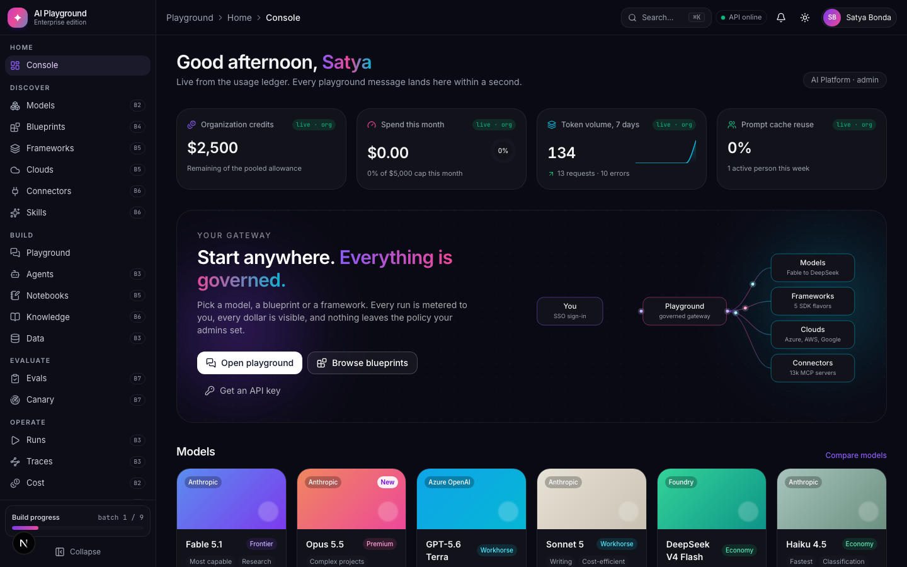
</p>

## Why it exists

Enterprises adopting generative AI tend to end up with the same four problems: many disconnected model subscriptions, no single view of usage and cost, no safe path from a chat prompt to a production agent, and no way to see which teams are actually gaining time. This product answers all four in a single, opinionated surface.

| Need | What the playground provides |
| --- | --- |
| Multi-model access | A governed catalog of 30 models across eleven providers (Anthropic, OpenAI, Azure OpenAI, Google, DeepSeek, NVIDIA NIM with Nemotron and Hermes, Mistral, xAI, Groq, Cohere, Hugging Face) with live prices and lifecycle state. People bring their own keys from a Keys drawer, as in the OpenAI or Claude playgrounds; platform keys stay hidden. |
| Security and governance | Entra ID sign-in, role-based model policies, per-user and pooled budgets with alerts and hard stops, and an internal-key boundary between web and API. |
| Cost management | A ledger that records every call with tokens, cached tokens, latency, cost and which key paid, and a cockpit that slices it by day, department, user, feature, model, provider, key source and conversation. |
| Smart spend | A deterministic router that classifies each prompt into Economy, Workhorse or Premium and records the savings against a premium baseline. |
| Agent building | Six runnable domain blueprints on a LangGraph runtime with checkpoints, human review gates and resumable runs, plus a catalog of 175 imported and authored agent definitions. |
| From playground to production | Any blueprint renders into an OpenAI Agents SDK, LangGraph, CrewAI, Microsoft Agent Framework or Google ADK project, with deploy scripts for Azure AI Foundry, Anthropic Managed Agents, AWS AgentCore and Google Agent Engine. |
| Notebooks | Every run, conversation and blueprint opens as a Jupyter notebook in the browser, with a metered server sandbox for real packages. |
| Low-code path | A six-field wizard that creates an agent and exports a Microsoft 365 declarative agent manifest for Copilot Studio. |
| Connectors | A governed snapshot of the official MCP registry with admin approval, live connection tests, and the playground itself exposed as an MCP server for Claude Desktop, Cursor and VS Code. |
| Knowledge | Knowledge Spaces over documents, pages, datasets and repositories with hybrid retrieval, cited answers, and a code map drawn as a graph. |
| Skills | 338 SKILL.md packs, searchable and attachable to any agent, shipped with every generated project. |
| Evaluate | Golden sets built in a guided wizard, deterministic checks plus a model-graded rubric, gates, nightly canaries with drift detection and automatic rollback, and a five-level hardening ladder lit only by evidence. |
| Community | A showcase with outcomes, likes and comments, challenges judged by the evaluation engine, twelve evidence-based achievements, and leaderboards by person and department. |
| Adoption | Hours per feature from ledger sessions, cost per outcome, estimated hours saved with visible assumptions, an ROI matrix by department, and a digest written by a platform agent. |

## What is in the box

The application is organised into seven sections, laid out the way a cloud console is.

| Section | Pages | Status |
| --- | --- | --- |
| Home | Console with credits, spend, tokens, models used and a live ledger | Live |
| Discover | Models, Blueprints, Frameworks, Clouds, Connectors, Skills | Live |
| Build | Playground, Agent Hub, Notebooks, Knowledge, Data | Live |
| Evaluate | Evals, Canary | Live |
| Operate | Runs, Traces, Cost, Adoption | Live |
| Community | Showcase, Challenges, Leaderboard | Live |
| Admin | Users, Policies, Budgets, Settings | Live |

See [docs/DEMO_SCRIPT.md](docs/DEMO_SCRIPT.md) for a step-by-step walk through every capability, [docs/DEPLOYMENT.md](docs/DEPLOYMENT.md) for the Azure topology, costs and the one-command deploy, [docs/SECURITY.md](docs/SECURITY.md) for the security model, [docs/ARCHITECTURE.md](docs/ARCHITECTURE.md) for how the pieces fit together, [docs/WORKFLOWS.md](docs/WORKFLOWS.md) for the user journeys and the build workflow, [docs/API.md](docs/API.md) for the API surface, and [docs/BATCHES.md](docs/BATCHES.md) for the delivery log.

## Architecture

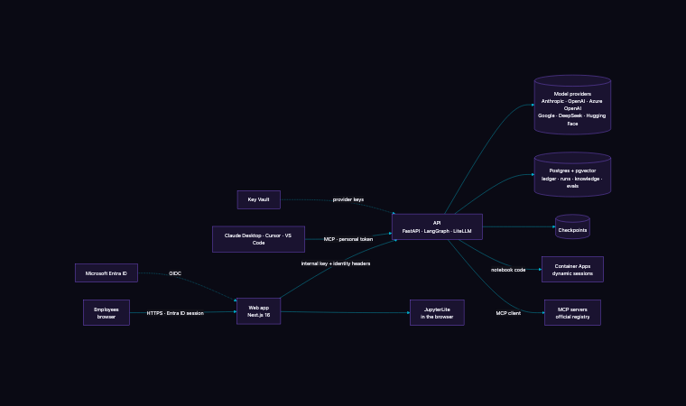

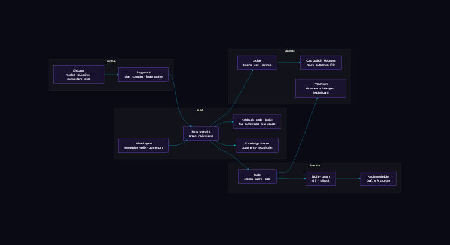

## Screens

| | |
| --- | --- |
| 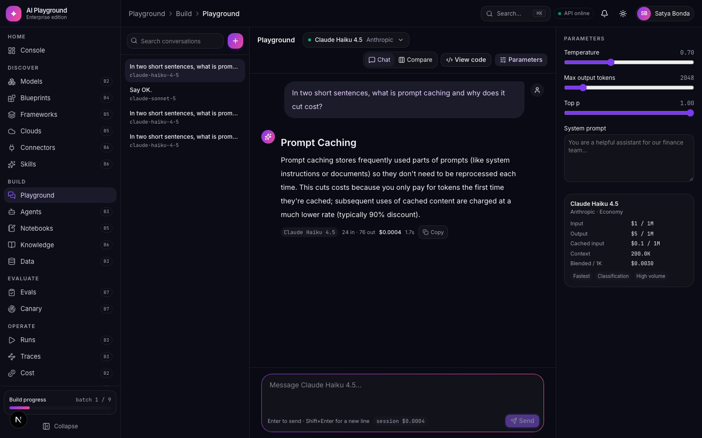 Playground with streaming, parameters and code view | 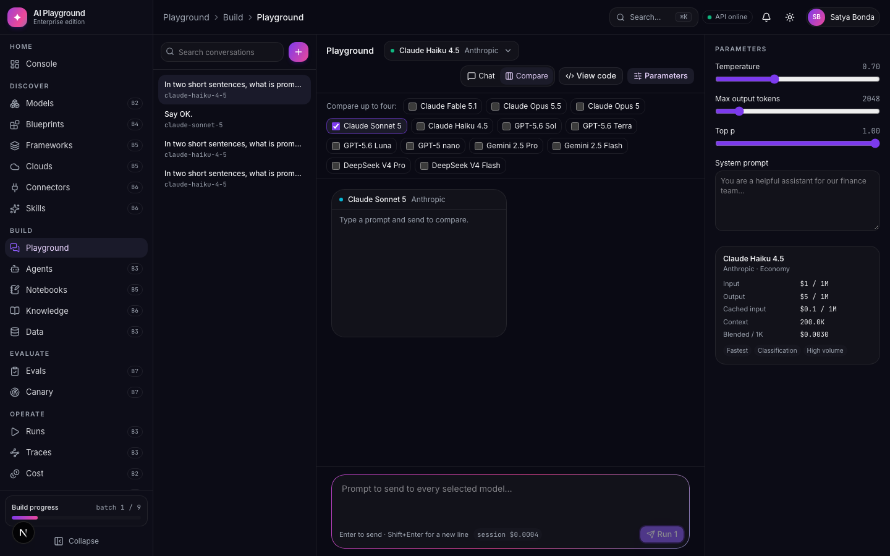 Four models side by side on the same prompt |
| 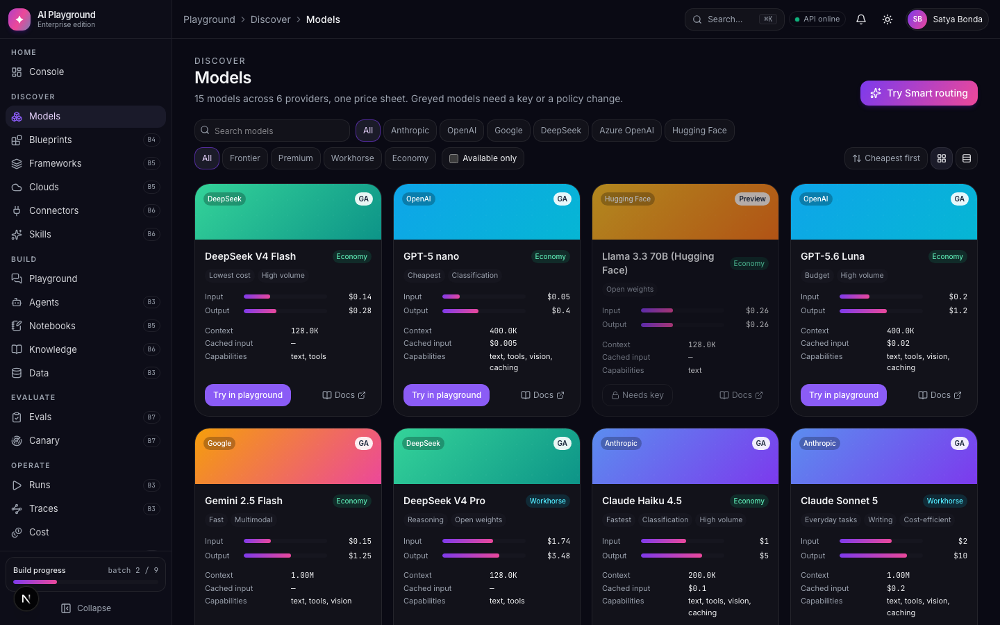 Model catalog with prices, tiers and availability | 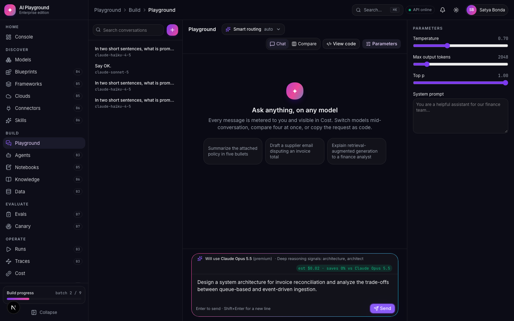 Smart routing preview with the savings it will record |
| 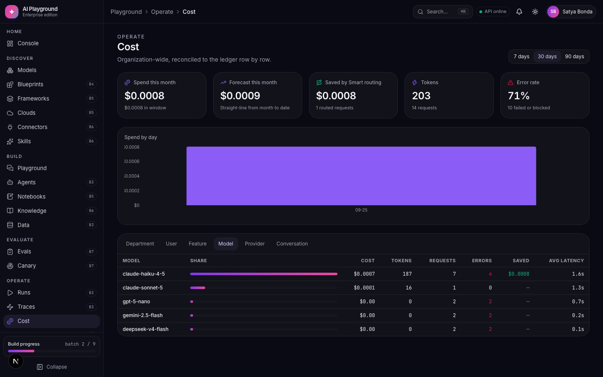 Cost cockpit across seven layers | 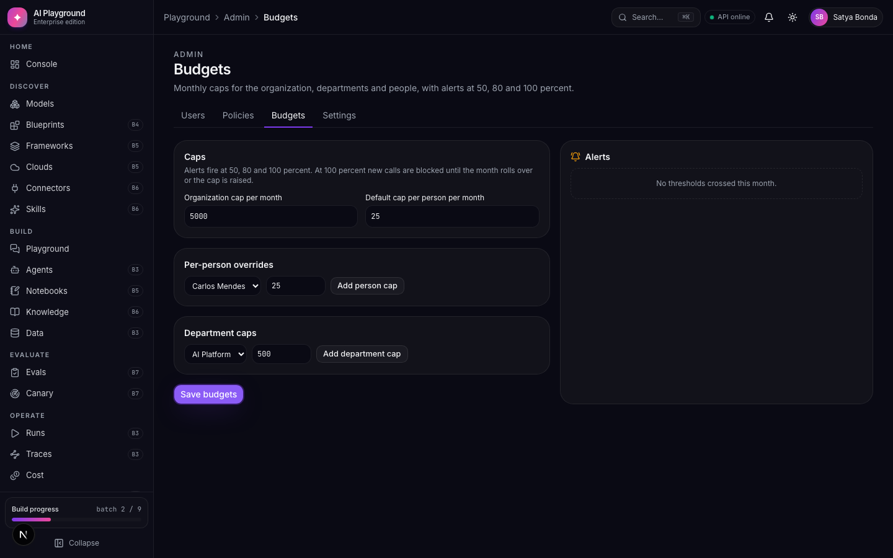 Budgets with alerts at 50, 80 and 100 percent |
| 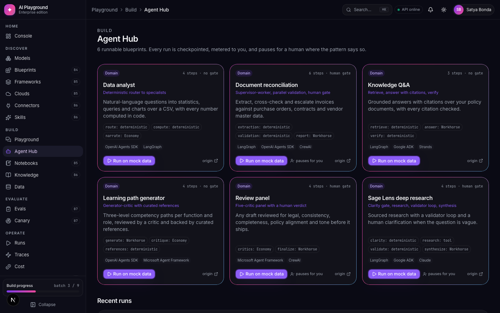 Agent Hub with runnable blueprints | 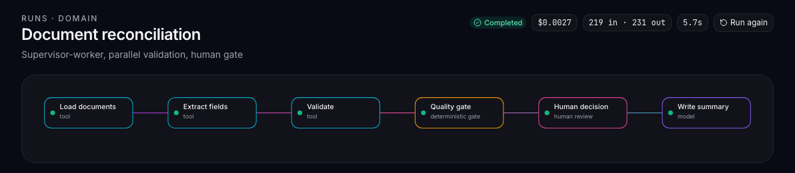 A run in flight with its graph and step trace |
| 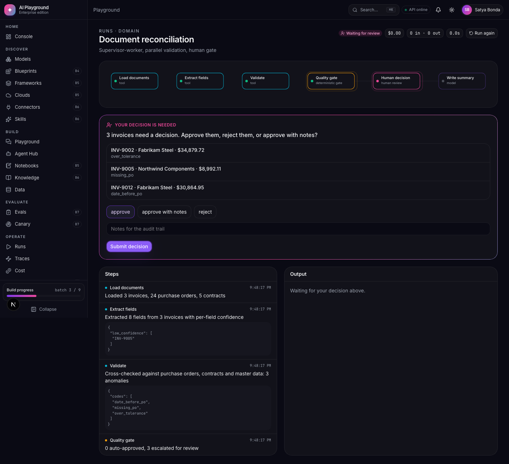 Human review gate that survives a restart | 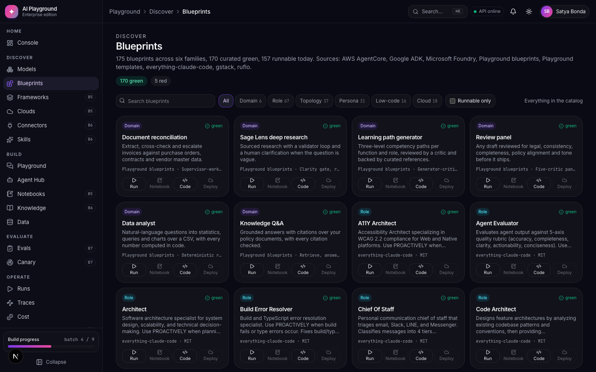 Blueprint catalog across six families |
| 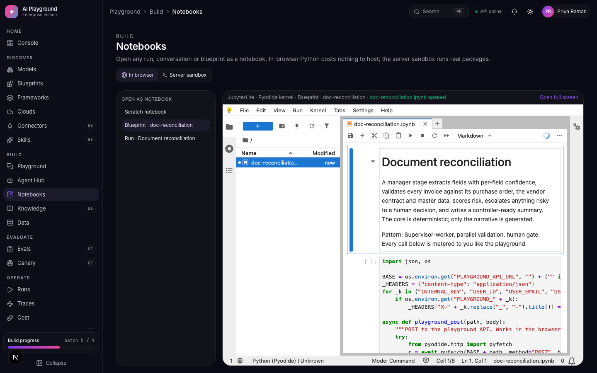 A blueprint opened as a notebook in the browser | 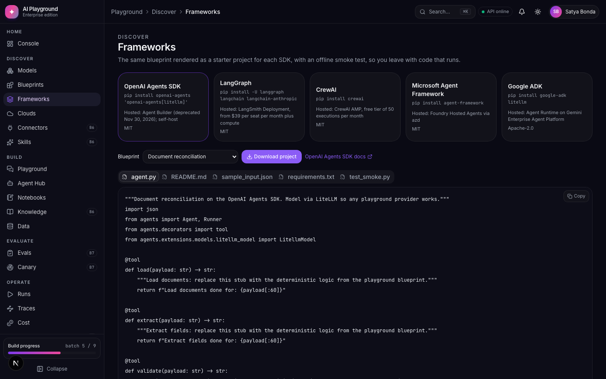 The same agent rendered as a CrewAI project |
| 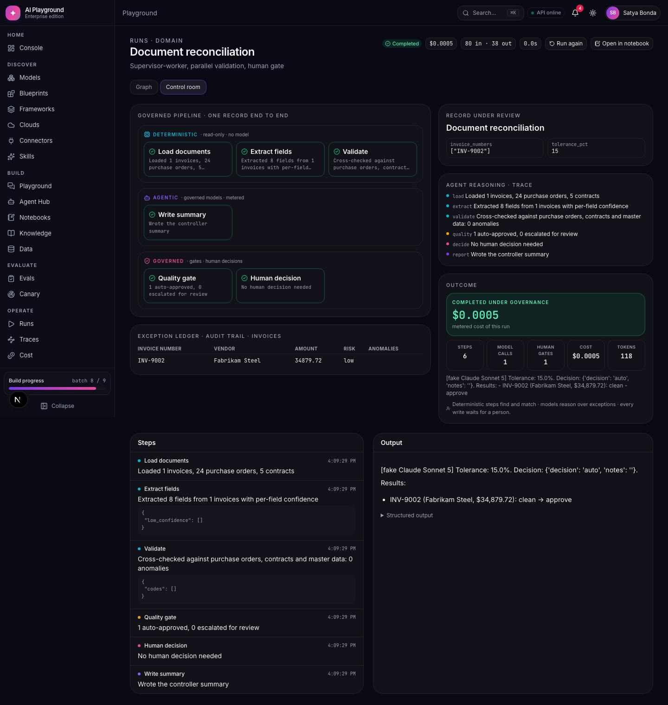 Any run as a control room: governed lanes, ledger, outcome | 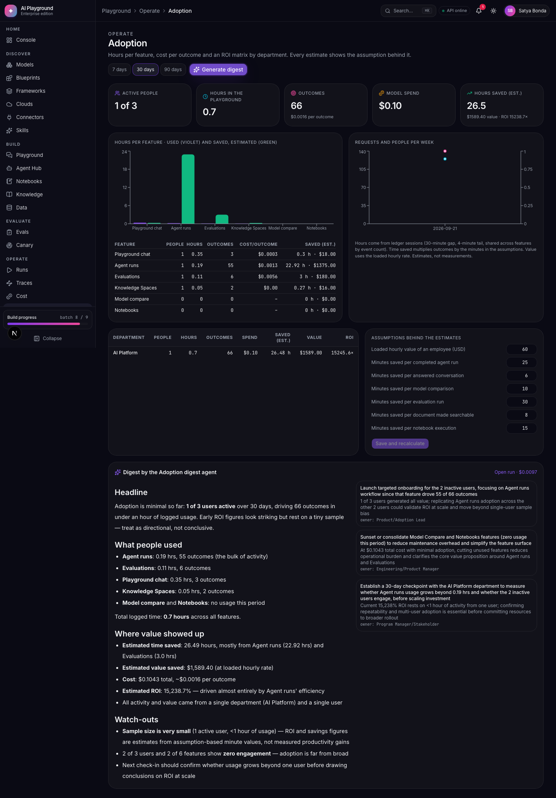 Adoption analytics with hours per feature and an ROI matrix |

## Quick start

Prerequisites: Node 22 or later, Python 3.12 and [uv](https://docs.astral.sh/uv/). Add provider keys to `.env` as platform keys, or add your own from the Keys drawer once signed in; without any key the offline provider answers deterministically at no cost.

```bash
git clone https://github.com/git-bonda108/Agentic-AI-enterprise-playground.git
cd Agentic-AI-enterprise-playground
npm run start:local
```

The launcher installs dependencies, builds the in-browser notebook runtime, seeds a demo tenant (ten people, a month of governed usage, runs, knowledge, evaluations, a canary, showcase posts and a judged challenge), starts the API on port 8000 and the web app on port 3000, and opens the browser. Add provider keys to `.env` for live models, or run `npm run start:offline`.

Sign in as Satya Bonda (administrator, password `playground`), or as any of the other nine seeded people to see different roles and departments.

| Script | Purpose |
| --- | --- |
| `npm run start:local` | Install, seed, start both services, open the browser |
| `npm run start:offline` | The same with the deterministic provider |
| `npm run seed:reset` | Rebuild the demo tenant |
| `npm run api`, `npm run dev` | Run the API or the web app on their own |
| `npm run diagrams` | Re-render the architecture diagrams |

To run fully offline, start the API with `PLAYGROUND_FAKE_LLM=true`. Every model becomes available and returns deterministic text, while the ledger, router, budgets and agent runtime behave exactly as they do with live providers.

## Testing

| Layer | Command | What it covers |
| --- | --- | --- |
| API | `cd apps/api && uv run pytest` | Ledger, streaming, a 100-prompt routing set, governance, agent golden cases, restart survival, catalog, notebooks, framework projects, deploy scripts, wizard |
| Web types and lint | `npm run typecheck && npm run lint` | Strict TypeScript and React Compiler rules |
| End to end | `npm run test:e2e` | Playwright against a production build and an offline API, including an axe accessibility pass |

The end-to-end suite starts its own API on port 8011 and web server on port 3101, with a fresh database every run.

## Repository layout

```
apps/
  web/            Next.js 16 application: sections, components, auth, API proxy, Playwright tests
  api/            FastAPI service: catalog, gateway, ledger, router, governance, agent runtime, faces
    app/agents/   LangGraph runtime, blueprint primitives, six domain blueprints, mock data, golden cases
    catalog/      Imported agent definitions (everything-claude-code, gstack, ruflo) as committed JSON
    scripts/      One-time importers that refresh the catalog from public repositories
    tests/        pytest suite
docs/             Architecture, workflows, delivery log, API reference, screenshots
infra/            docker-compose for Postgres with pgvector, Redis and the optional LiteLLM proxy
scripts/          JupyterLite build
```

## Design principles

- **Governed by default.** Nothing reaches a provider without a policy check, a budget check and a ledger row. There is no unmetered path.
- **Deterministic where it can be.** Routing, validation, citation checks and reconciliation logic are plain code. Models write narrative; code makes decisions.
- **Runnable, not documentary.** Every blueprint runs on mock data in one click, opens as a notebook, renders into five frameworks and ships with deploy scripts.
- **Portable.** SQLite on a laptop, Postgres with pgvector in a tenant; the same code, one environment variable apart.
- **Honest numbers.** Prices come from the providers' published sheets and are stored with the model, so the cost you see is the cost you will pay.

## Licences of imported material

The catalog includes agent definitions imported from public repositories, each stored with its source path, licence and link: everything-claude-code (MIT), gstack (MIT) and ruflo (MIT). Cloud sample mirrors reference the official AWS, Google and Microsoft samples. Model prices are taken from the providers' public pricing pages and dated in the catalog.

## Roadmap

Batches 0 to 9 built the product; Batch 10 added bring-your-own keys and thirteen more models. Batches 11 to 15 (executable notebooks with compute choice, agents on every framework, cloud platform guides, datasets and deeper cost analytics, a documentation hub) are planned in [docs/BATCHES.md](docs/BATCHES.md).
