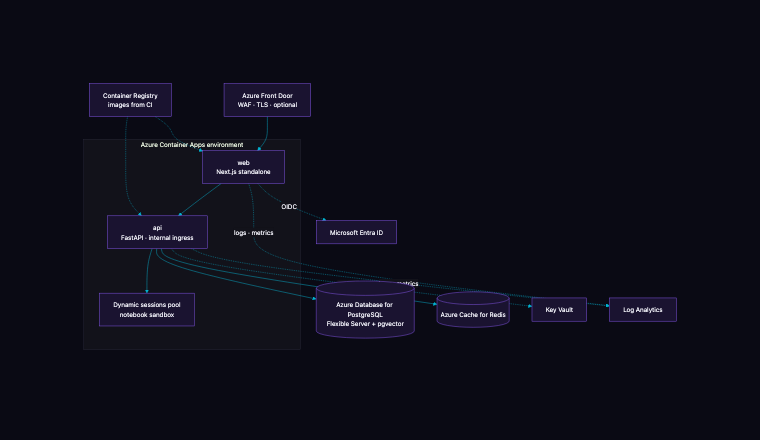

# Deployment

How the playground runs on Azure, what it costs to run, and the exact steps to deploy it. Everything here is in the repository: the Bicep template, the container images, the deploy script and the CI pipeline that validates them on every push.



## 1. What gets deployed

| Resource | Purpose | Pilot sizing | Why this choice |
| --- | --- | --- | --- |
| Container Apps environment | Runs both services with scale-to-zero, revisions and built-in TLS | Consumption plan | No cluster to manage; per-second billing; revision rollbacks |
| `web` container app | Next.js standalone build, public ingress | 0.5 vCPU, 1 GiB, 1 to 3 replicas | Serves the UI and proxies to the API with the internal key |
| `api` container app | FastAPI, LangGraph runtime, canary scheduler, MCP endpoint, internal ingress only | 1 vCPU, 2 GiB, 1 to 3 replicas | Never exposed to the internet; only the web app reaches it |
| Dynamic sessions pool | Executes notebook code in Hyper-V isolated sandboxes | 0 ready sessions, 10 concurrent | Untrusted code never runs in the API container |
| Azure Database for PostgreSQL Flexible Server | Ledger, runs, knowledge chunks (pgvector), evaluations, community | Burstable B1ms, 32 GB | Managed backups, Entra authentication, vector extension enabled |
| Azure Cache for Redis | Shared state when running more than one API replica | Basic C1 | Horizontal scaling |
| Key Vault | Provider keys, internal key, Auth.js secret, Entra client secret | Standard | RBAC access from the API's managed identity |
| Container Registry | Images built by CI or by `az acr build` | Basic | No local Docker needed |
| Log Analytics | Logs and metrics for both apps | Pay per GB | Container Apps streams console and system logs |
| Microsoft Entra ID | Sign-in | Existing tenant | No user database to run |

Optional in front: Azure Front Door with WAF for a custom domain and edge protection. The template leaves it out for the pilot because Container Apps already terminates TLS on its own domain.

## 2. Monthly running cost, pilot sizing

Retail pay-as-you-go prices for West Europe, September 2026, rounded. Model spend is separate and shown in the cost cockpit.

| Line | Estimate per month |
| --- | --- |
| Container Apps, two apps at minimum one replica each | 45 to 70 USD |
| PostgreSQL Flexible Server B1ms with 32 GB | 25 to 35 USD |
| Azure Cache for Redis C1 | 100 USD |
| Dynamic sessions, occasional notebook use | 5 to 20 USD |
| Container Registry Basic | 5 USD |
| Log Analytics, Key Vault | 5 to 15 USD |
| Total platform | about 190 to 250 USD |

Redis is the largest fixed line; drop it for a single-replica pilot (the API keeps rate-limit state in memory) and the platform lands near 100 USD a month. Production sizing (General Purpose D2ds_v5 Postgres with zone redundancy, two ready sessions, three replicas) is roughly 450 to 600 USD a month.

## 3. Deploy in one command

Prerequisites: Azure CLI signed in with rights to create resources in a subscription, and the provider keys you want to enable.

```bash
export PG_PASSWORD='a-long-random-password'
export PLAYGROUND_INTERNAL_KEY="$(openssl rand -hex 32)"
export AUTH_SECRET="$(openssl rand -hex 32)"
export PLAYGROUND_KEY_ENCRYPTION_KEY="$(python3 -c 'from cryptography.fernet import Fernet; print(Fernet.generate_key().decode())')"
export ANTHROPIC_API_KEY='sk-ant-...'          # platform keys are optional: people can bring their own from the Keys drawer
export NVIDIA_NIM_API_KEY='nvapi-...'
infra/deploy.sh rg-ai-playground westeurope aiplay
```

The script creates the resource group, builds both images in Azure Container Registry (no local Docker), deploys the Bicep template, writes the outputs to `infra/last-deployment.json` and waits until the web app answers its health check. Rerunning it with a new git commit builds new images and rolls a new revision; Container Apps keeps the previous revision for instant rollback.

To sign in with Entra ID instead of the seeded pilot users, register an application in the tenant (web platform, redirect URI `https://<web-fqdn>/api/auth/callback/microsoft-entra-id`) and export `AUTH_MICROSOFT_ENTRA_ID_ID`, `AUTH_MICROSOFT_ENTRA_ID_SECRET` and `AUTH_MICROSOFT_ENTRA_ID_ISSUER` before running the script. Development sign-in switches itself off as soon as a client id is present.

## 4. What the pipeline checks before an image exists

The GitHub Actions workflow runs on every push and pull request:

1. API: ruff and the pytest suite with the offline provider.
2. Web: strict TypeScript, ESLint with React Compiler rules, the JupyterLite build, and the Playwright suite against a production build and a fresh database.
3. Security: gitleaks over the full history, `npm audit` for production dependencies, `pip-audit` for the API.
4. Infrastructure: `az bicep build` on the template.
5. On main only: both container images are built with the exact Dockerfiles the deploy script uses.

## 5. Configuration the API refuses to run with

Outside a local environment the API exits at start-up if any of these hold: the internal key is the development default or shorter than 24 characters, the fake provider is on, the database is SQLite, a plain-http origin is allowed for CORS, or the key encryption key is missing. The Bicep template satisfies all of them; the guard exists so a hand-edited configuration cannot.

## 6. Operations

| Task | Command |
| --- | --- |
| Follow API logs | `az containerapp logs show -n aiplay-api -g rg-ai-playground --follow` |
| Roll back the web app | `az containerapp revision list -n aiplay-web -g rg-ai-playground` then `az containerapp ingress traffic set ... --revision-weight <previous>=100` |
| Rotate a provider key | `az keyvault secret set --vault-name <kv> --name anthropic-api-key --value ...` then `az containerapp secret set` and a new revision |
| Scale the API | `az containerapp update -n aiplay-api -g rg-ai-playground --min-replicas 2 --max-replicas 5` |
| Database backup | Automatic, seven days; `az postgres flexible-server backup list` |

## 7. Data residency and boundaries

All resources live in one region of your choosing. Model calls leave the tenant to the providers you enabled and no others; the catalog shows which providers are configured. Notebook code runs in the sessions pool with egress disabled. The MCP endpoint is reachable only through the web app's domain and only with a personal token issued in the product.
