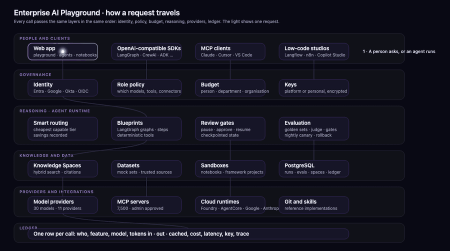
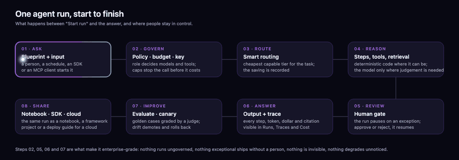

# Design overview

What the Enterprise AI Playground is, how it is built, and how the agents inside it work. Written for people in IT and the business who decide, buy and operate, not only for engineers. Two pages of tables, then the detail you need when you need it.

## In one screen

| | |
| --- | --- |
| **What it is** | One governed place where an organisation's people explore every model, run and build agents, and see every token and dollar |
| **Who uses it** | Explorers (try and learn), builders (make agents and notebooks), champions (lead a department), administrators (policy, budgets, keys) |
| **Where it runs** | Azure Container Apps from one command; the same images run on any container platform; sign-in through Entra, Google, Okta or any OpenID Connect provider |
| **What it costs to run** | About 90 to 150 USD a month at pilot sizing, plus model usage, which the ledger shows per person |
| **What makes it enterprise-grade** | Every call passes identity, policy and budget before it runs; every run can pause for a person; every step is traced; every agent is evaluated nightly and rolled back on drift |

## How a request travels

| Layer | What it does | What you get |
| --- | --- | --- |
| People and clients | The web app, OpenAI-compatible SDKs, MCP clients (Claude, Cursor, VS Code) and low-code studios all enter through the same door | One set of rules whatever tool a person prefers |
| Governance | Identity, role policy (which models, tools and connectors), budgets per person, department and organisation, encrypted keys | Nothing runs ungoverned; a cap stops a call before it costs |
| Reasoning | Smart routing to the cheapest capable model, blueprints as explicit step graphs, review gates that pause for a person, evaluation and canaries | Predictable behaviour and a person in the loop where it matters |
| Knowledge and data | Knowledge Spaces with cited retrieval, mock datasets and trusted public sources, sandboxes for notebooks and framework projects, PostgreSQL | Grounded answers and safe experiments |
| Providers and integrations | 30 models across 11 providers, 7,500 MCP servers behind admin approval, four cloud runtimes, reference repositories and skills | Choice without lock-in |
| Ledger | One row per call: who, feature, model, tokens in, out and cached, cost, latency, key, trace | Cost and usage that reconcile to the cent |

## One agent run, start to finish

1. **Ask.** A person, a schedule, an SDK call or an MCP client starts a blueprint with an input.
2. **Govern.** The person's role decides the allowed models and tools; the budget is checked; the platform or personal key is resolved.
3. **Route.** Smart routing picks the cheapest tier that can do the job and records the saving against a premium baseline.
4. **Reason.** The blueprint runs its steps: deterministic code wherever the answer can be computed, the model only where judgement is needed, retrieval with citations where facts are needed.
5. **Review.** On an exception the run pauses at a human gate; a reviewer approves or rejects and the run resumes from its checkpoint.
6. **Answer.** The output comes with its trace: every step, token, dollar and citation, visible in Runs, Traces and Cost.
7. **Improve.** Golden cases graded by a judge model gate the agent's hardening level; the nightly canary demotes and rolls back on drift.
8. **Share.** The same run becomes a notebook, a framework project for any SDK, a low-code flow, or a step-by-step cloud deployment.

## The agents, and what happens behind the scenes

Every agent is a blueprint: an explicit graph of steps with three kinds of node. **Tool** steps are ordinary code (load, extract, compute, retrieve) and never call a model. **Model** steps call a model with a narrow brief. **Gate** steps decide, and **human** gates pause. This split is what keeps cost, latency and behaviour predictable: the model does only the parts that need language or judgement.

| Agent | What it is for | Behind the scenes | Where a person decides |
| --- | --- | --- | --- |
| Document reconciliation | Match supplier invoices to purchase orders and contracts before payment | Load documents → extract fields → validate against tolerances → quality gate → write a summary of exceptions | The human decision step on any invoice that fails validation |
| Sage Lens deep research | Sourced research on a question | Clarity gate → research over the corpus → validate coverage → synthesise with sources | A clarification when the question is vague |
| Learning path generator | Three-level learning paths per role | Generate the path → a critic reviews it → curate references from a vetted list → assemble | Review of the published path |
| Review panel | Any draft checked before it ships | Load the draft → five critics (legal, consistency, completeness, policy, tone) → human verdict → revise or publish | The verdict |
| Data analyst | Questions over a CSV with every number computed in code | Load the file → route the question → compute with pandas → narrate the result | None needed: numbers never come from the model |
| Knowledge Q&A | Grounded answers over policy documents | Retrieve passages → answer with citations → verify every citation exists | Answers without valid citations are flagged |

The platform runs itself with the same machinery. **Key health check** sends a tiny completion through every platform key and raises an alert when a provider rejects one. **Cost sentinel** compares yesterday's spend per department and feature with the trailing week and explains anomalies. **Connector reviewer** shortlists pending MCP servers and recommends approve, hold or block. **Onboarding coach** reads what a person has used and suggests their next three steps. **Adoption digest** and **Showcase writer** turn analytics and runs into short posts that a person edits before publishing.

Custom agents built in the wizard use the same runtime: instructions, Knowledge Spaces, skills, built-in tools (calculator, datasets, knowledge search, web fetch, sandboxed Python) and approved MCP connectors, with the same governance and the same traces.

## Features, page by page

| Area | Page | What it does | What it offers |
| --- | --- | --- | --- |
| Home | Console | Credits, spend, tokens, hours by feature, models used | The state of adoption at a glance |
| Home | Documentation | Every guide, page how-to and the API reference, searchable, inside the product | Nothing to look up elsewhere |
| Discover | Models | 30 models across 11 providers with prices, context and capabilities; each runs on a platform key or your own | One price sheet for every model |
| Discover | Blueprints | 175 blueprints across six families, Gen AI or Agentic AI, each with two ways to build | Start from something that already works |
| Discover | Frameworks | The same blueprint as an OpenAI Agents SDK, LangGraph, CrewAI, Microsoft Agent Framework or Google ADK project, run in the sandbox through the gateway | Leave with code that runs |
| Discover | Low-code studios | Importable Langflow flows and n8n workflows, Copilot Studio recipes | The no-code route to the same agent |
| Discover | Cloud platforms | Foundry, AgentCore, Google Agent Runtime and Anthropic Managed Agents with portals, CLI sign-in and step-by-step deploy guides per framework and model | A path to production on any cloud |
| Discover | MCP Marketplace | 7,500 servers with ready-made configuration for seven clients; admins approve before agents may call | Integrations without surprises |
| Discover | Popular Git repos, Skills | The frameworks, harnesses and reference implementations behind the playground; SKILL.md packs for agents | Learn from the source |
| Build | Playground | Chat, compare four models side by side, copy the request as code, Smart routing | Fast, governed exploration |
| Build | Agent Hub | Run blueprints with review gates, build custom agents, take them to any SDK | From idea to working agent |
| Build | Notebooks | Every blueprint as a notebook that runs in the browser or a sandbox, with GPU options | Reproducible experiments |
| Build | Knowledge | Knowledge Spaces over documents, pages and repositories with hybrid search and cited answers | Grounded, auditable answers |
| Build | Datasets | Eight mock sets with schema and downloads, plus trusted public sources with loaders | Safe data, then real data |
| Evaluate | Evals, Canary | Golden sets, rubrics, a judge, gates; nightly reruns with drift alerts and rollback | Quality that is measured, not assumed |
| Operate | Runs, Traces, Cost, Adoption | Every run and its review inbox; every call as a timeline; cost drill-down to the ledger row with CSV export; hours, outcomes and ROI by department | Control without a separate tool |
| Community | Showcase, Challenges, Leaderboard | Published wins, judged builds, points earned from the ledger | Adoption that spreads on its own |
| Admin | Users, Policies, Budgets, Settings | Roles, per-role model and tool policy, caps with alerts, platform keys and their scope, personal tokens, MCP client setup | The controls in one place |

## Security and identity

| Concern | How it is handled |
| --- | --- |
| Sign-in | Microsoft Entra ID, Google Workspace, Okta or any OpenID Connect provider; e-mail domain and address allow-lists; administrators named by e-mail |
| Sessions | Stateless, signed; signing out records a time after which no earlier session is accepted |
| API exposure | The API is reachable only from the web tier with an internal key plus identity headers; never on the public internet |
| Keys | Platform keys in Key Vault; personal keys encrypted per person; every call records which key paid |
| Untrusted code | Notebook and framework code runs in isolated sandboxes with egress disabled on Azure |
| Data | One region; model calls leave only to the providers enabled; MCP servers only after admin approval |
| Change control | Every push runs lint, tests, end-to-end checks, secret scanning, dependency audit and template validation before an image exists |

## Deployment

One script provisions the resource group, registry, images, database, key vault, sessions pool and both container apps on Azure, then waits for the health check; a GitHub Actions workflow builds the images where cloud builds are not permitted. Re-running with a new commit rolls a new revision and keeps the previous one for rollback. Vercel, a single virtual machine and Kubernetes are assessed in the deployment guide; the recommendation is Azure Container Apps for the reasons the guide states.

## Glossary

| Term | Meaning |
| --- | --- |
| Blueprint | An agent defined as an explicit graph of tool, model, gate and human steps |
| Review gate | A step where a run pauses until a person approves or rejects |
| Smart routing | Choosing the cheapest model tier that can do the task, with the saving recorded |
| Ledger | The table with one row per model call that every cost view reconciles to |
| Knowledge Space | A searchable, cited collection of documents, pages or repositories |
| MCP | Model Context Protocol: the standard through which agents call external tools and data |
| Canary | A nightly re-run of an agent's golden cases to catch drift |
