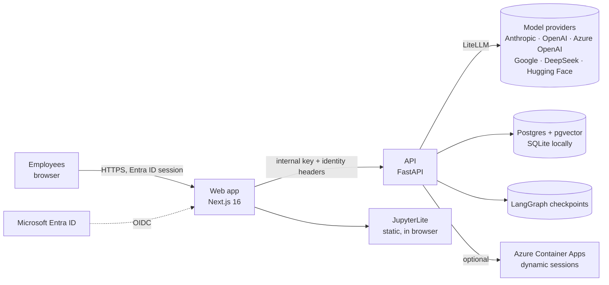
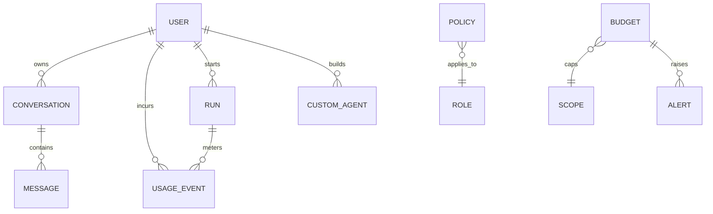
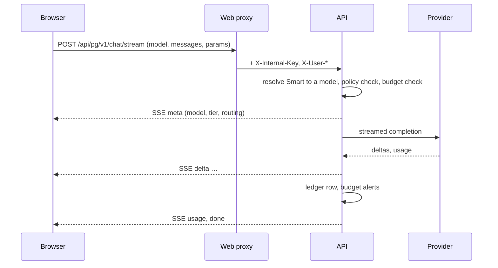
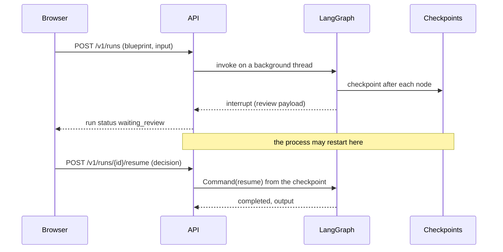
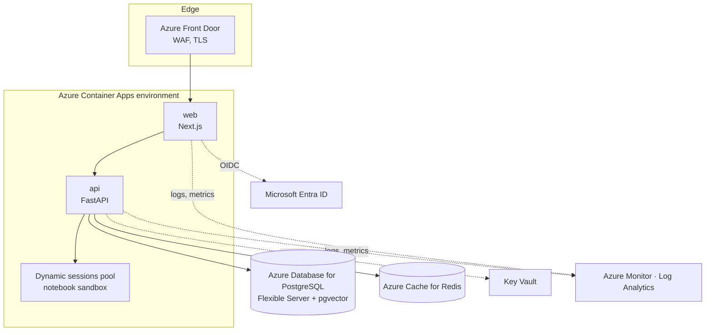

# Architecture

This document describes the system as built through Batch 5, and the Azure topology it is designed to run on. It is written for engineers who will operate or extend the playground, and for reviewers assessing its security posture.

## 1. System context

Two deployable services, one database, one checkpoint store. Everything else is either a static asset or an external provider.

## 2. Components

### 2.1 Web application (`apps/web`)

Next.js 16 with the App Router, React 19, Tailwind 4 and a small set of Base UI primitives. Responsibilities:

- **Identity.** Auth.js with Microsoft Entra ID in production and seeded development users locally. Sessions are JWTs; the role and department claims travel in the token.
- **API proxy.** Every browser call goes through `/api/pg/*`, a route handler that attaches the shared internal key and the signed-in user's identity headers before forwarding to the API. The browser never holds an API credential. Server-sent event bodies pass through untouched.
- **Sections.** Seven sections mapped one to one onto the navigation. Pages fetch on the server where the data is static for the request and hydrate client components for anything interactive.
- **Notebook host.** JupyterLite is built once into `public/jupyterlite`. The Notebooks page loads it in an iframe, saves the generated notebook through the runtime's own contents API and opens it. No notebook server is hosted.

### 2.2 API (`apps/api`)

FastAPI with SQLAlchemy 2. Responsibilities, in the order a request meets them:

1. **Identity.** `current_user` rejects any request without the internal key, then upserts the user from the identity headers. Roles: admin, builder, explorer.
2. **Catalog.** Fifteen model specifications with provider, tier (Economy, Workhorse, Premium, Frontier), input and output price per million tokens, capabilities, lifecycle state and documentation link. A model is available when its provider key is present.
3. **Gateway.** LiteLLM in-process. Streaming for the playground, blocking completions for agent nodes and notebooks. Provider-specific rules live here (for example, Anthropic rejects `temperature` together with `top_p`).
4. **Smart routing.** A deterministic classifier maps each prompt to a tier, picks the first available candidate in that tier, and records the difference against the premium baseline as savings.
5. **Governance.** Policies per role list allowed models and tiers. Budgets exist at organisation, department, user and user-default scope. Alerts fire once per period at 50, 80 and 100 percent; at 100 percent the call is blocked with HTTP 402 before any provider is contacted.
6. **Ledger.** One `usage_events` row per call with feature (`chat`, `compare`, `agent`, `notebook`), model, tokens in, out and cached, cost, latency, routing decision, run and blueprint identifiers.
7. **Agent runtime.** LangGraph graphs with a SQLite checkpointer. Runs execute on background threads, interrupt for human review, and resume after a process restart because state lives in the checkpoint store, not in memory.
8. **Faces.** The ways a blueprint leaves the playground: notebooks, framework projects, cloud deploy scripts and the declarative agent manifest.
9. **Connectors and the MCP server.** A snapshot of the official MCP registry with an approval workflow, a streamable-HTTP MCP client for probes and tool calls, and the playground's own MCP endpoint behind personal tokens.
10. **Knowledge.** Chunking, embeddings (local or provider), hybrid retrieval and the repository mapper, all metered as feature `knowledge`.

### 2.3 Data model

Monetary values are stored in USD with the price sheet that produced them, so historical rows keep their original cost after a price change.

## 3. Request flows

### 3.1 Playground chat

### 3.2 Agent run with a review gate

Every model call inside a node goes through the same governance and ledger path as the playground, tagged with the run and blueprint identifiers.

## 4. Blueprints

A blueprint is a Python module that registers a `Blueprint` with a manifest (identity, pattern, tiers per node, graph layout, samples, datasets, review gates, dashboard tiles, links) and a `build(checkpointer)` function returning a compiled LangGraph graph. Six domain blueprints ship today.

| Blueprint | Pattern | Review gate |
| --- | --- | --- |
| Document reconciliation | Supervisor and workers, parallel validation, human gate | Escalations over a risk threshold |
| Sage Lens | Deep research with clarification, plan, parallel search, synthesis | Clarifying question when the brief is vague |
| Learning path | Profile, plan, sequence, validate | None |
| Review panel | Parallel reviewers, consensus, verdict | Split decisions |
| Data analyst | Plan, query, chart, narrate over CSV | None |
| Knowledge Q&A | Retrieve, answer with citations, verify | None |

Imported catalog entries (roles, personas, topologies, low-code templates and cloud mirrors) run on a shared generic graph that loads instructions, retrieves knowledge, calls the governed model and checks the output. Every blueprint has ten golden cases used by the test suite.

## 5. Security model

| Boundary | Control |
| --- | --- |
| Browser to web | Entra ID OIDC, HTTP-only session cookie, CSRF handled by Auth.js |
| Web to API | Shared internal key in a header; identity asserted by the web tier only. The API is not exposed to browsers. |
| API to providers | Keys in the environment (Key Vault in Azure), never in the database or in responses |
| Model access | Role policies, evaluated before every call |
| Spend | Budgets with a hard stop at 100 percent |
| Code execution | Notebook code runs in the browser (Pyodide) or in an isolated subprocess locally; Azure Container Apps dynamic sessions in production |
| Imported content | Stored with source, path and licence; instructions are shown to models, never executed as code |

## 6. Azure topology

Sizing for a pilot of up to ten users is two small Container Apps, a burstable Postgres, a C1 Redis and a sessions pool that scales to zero. Each of these has a published pay-as-you-go price, and the cost cockpit's platform layer is designed to show them next to model spend. Bicep templates land in Batch 9.

## 7. Local development

- SQLite and a file-based checkpoint store; no Docker required.
- `PLAYGROUND_FAKE_LLM=true` turns every model into a deterministic offline provider.
- `infra/docker-compose.yml` starts Postgres with pgvector, Redis and an optional LiteLLM proxy for teams that prefer a gateway process.
- Playwright runs against a production build, so what is tested is what ships.
