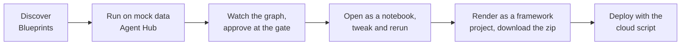
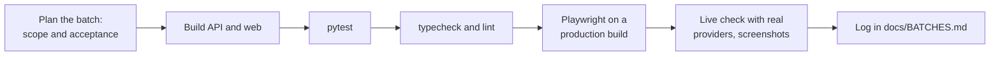

# Workflows

How people use the playground, and how the playground is built and shipped.

## 1. User journeys

### 1.1 Explorer: from a question to a saved comparison

1. Sign in with the company identity. The console shows personal credits, this month's spend and the models used.
2. Open **Build → Playground**, pick a model or leave **Smart** selected, and ask. The reply streams with tokens, cost and latency in the footer.
3. Add up to three more models with **Compare** to see the same prompt answered side by side, each with its own cost.
4. Open **View code** to copy the equivalent call in Python, TypeScript, curl, the Anthropic SDK or the OpenAI SDK.
5. Save the conversation with tags. It appears in the sidebar and in the Cost cockpit under its own row.

### 1.2 Builder: from a blueprint to a deployed agent



1. Browse **Discover → Blueprints**. Filter by family, search, or show runnable entries only. Every card has four faces: Run, Notebook, Code, Deploy.
2. **Run** opens a dialog with sample inputs and an editable JSON body. The run page animates the graph, shows every step with timing and tokens, and pauses at a human review gate when the blueprint has one.
3. **Notebook** opens the same run as a Jupyter notebook in the browser, with helper cells that call the playground API under your identity. Use the server sandbox tab for real packages.
4. **Code** renders the blueprint as an OpenAI Agents SDK, LangGraph, CrewAI, Microsoft Agent Framework or Google ADK project, complete with a README, sample input, requirements and an offline smoke test. Download the zip.
5. **Deploy** shows the exact commands for Azure AI Foundry, Anthropic Managed Agents, AWS AgentCore or Google Agent Engine, with the pricing unit and prerequisites for each.

### 1.3 Low-code author: an agent without code

1. Open **Build → Agent Hub → Create your own agent**.
2. Fill the six fields a Copilot Studio author expects: name, description, instructions, knowledge, starter prompts, publish.
3. Run it immediately under your model policy and budget.
4. Export the Microsoft 365 declarative agent manifest and import it into Copilot Studio.

### 1.4 Administrator: governance in five minutes

1. **Admin → Policies**: set which tiers and models each role may use.
2. **Admin → Budgets**: set the organisation cap, department caps and the default per-user cap. Alerts arrive in the bell at 50, 80 and 100 percent; at 100 percent calls stop.
3. **Admin → Users**: change roles and departments; identity itself comes from Entra ID.
4. **Operate → Cost**: slice spend by day, department, user, feature, model, provider or conversation, and see the savings Smart routing has recorded.

## 2. Build and test workflow

The product is delivered in numbered batches. Each batch ends runnable, with every test green, before the next starts.



### 2.1 Commands

```bash
cd apps/api && uv run pytest -q          # API suite
cd apps/api && uv run ruff check .       # Python lint
npm run typecheck                        # strict TypeScript
npm run lint                             # ESLint with React Compiler rules
npm run test:e2e                         # Playwright, builds the web app first
```

### 2.2 Test pyramid

| Level | Scope | Notes |
| --- | --- | --- |
| Unit and API | Catalog prices, routing classifier over a 100-prompt set, governance gates, ledger arithmetic, blueprint golden cases, generated framework projects, deploy scripts | Offline provider, in-memory database, temporary checkpoint store |
| End to end | Sign-in, playground streaming, compare, Smart routing, budgets, agent runs with review, catalog, notebooks, frameworks, clouds, wizard | Production build, fresh database per run, reduced motion, dark theme, axe accessibility checks |
| Live | Real provider keys, screenshots for the delivery log | Manual, before each batch is declared done |

### 2.3 Conventions

- Prices, model identifiers and lifecycle dates live in the catalog with the source they came from.
- Anything that reaches a provider is metered; a new feature adds a `feature` value to the ledger, never a bypass.
- Imported content keeps its source path and licence.
- The web app never talks to a provider; only the API does.
- Tests assert on stable `data-testid` hooks and exact accessible names, never on layout.

## 3. Release workflow

1. Merge to `main` with the full suite green.
2. Build the two container images (web and API) and the JupyterLite bundle.
3. Deploy to the Container Apps environment with the Bicep templates (Batch 9) and run the smoke suite against the deployed URL.
4. Roll forward only; database migrations are additive.
